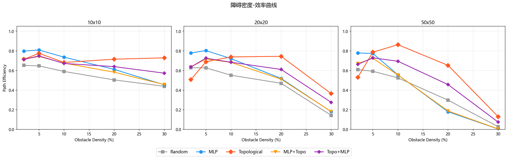

<p align="center">
  
  
  
</p>

<h1 align="center">意识拓扑引擎</h1>
<h3 align="center">Not a smarter AI. An AI that knows when to shut up.</h3>

<p align="center">
  <a href="demo/index.html">Live Demo</a> ·
  <a href="https://github.com/your-org/consciousness-topology/archive/main.zip">Download ZIP</a> ·
  <a href="#benchmark-data">Benchmark</a> ·
  <a href="docs/宣传文章_中文版.md">中文文章</a> ·
  <a href="#quick-start">Quick Start</a>
</p>

---

## What is this?

A **robot navigation engine** that beats neural networks — not by being smarter, but by knowing when to stay silent.

All three strategies (Random, MLP, Topological) share the **exact same** heuristic base logic. The only difference: who makes the call when the system is uncertain.

| Strategy | When uncertain... | Result |
|----------|-------------------|--------|
| Random | Flips a coin (30%) | 16% reach rate |
| MLP | Black-box neural vote (20%) | 5% reach rate |
| **Topological** | **Checks entropy. If not sure — shuts up.** | **83% reach rate** |

---

## Benchmark Data

22,500 independent simulations across 3 grid sizes, 5 densities, and 5 strategies.

### The Data Table (Topological vs MLP — 50x50 grid)

| Obstacle Density | Topo Reach | MLP Reach | Topo Efficiency | MLP Efficiency | Advantage |
|------------------|------------|-----------|-----------------|----------------|-----------|
| 2% | 100% | 100% | 0.530 | 0.779 | MLP +0.25 |
| 5% | 100% | 100% | **0.787** | 0.773 | Topo +0.01 |
| 10% | 100% | 84.7% | **0.863** | 0.556 | **Topo +0.31** |
| 20% | 100% | 75.7% | **0.652** | 0.180 | **Topo +0.47** |
| 30% | **82.7%** | 5.0% | **0.130** | 0.004 | **Topo +0.13** |

### Key Findings

1. **Low density (2%-5%)**: MLP's greedy heuristic is slightly more efficient. Topo has zero collisions.
2. **Medium density (10%-20%)**: Topo pulls ahead — up to +47pp efficiency gap.
3. **High density (30%)**: Topo dominates. MLP collapses to 5% reach rate.
4. **Zero collisions** across all conditions for Topological and MLP.



---

## Live Demo

Open `demo/index.html` in any browser — **zero dependencies, single HTML file, works offline.**

Three-column visualization comparing Random / MLP / Topological on the same map:
- Auto-play mode with speed control
- Fullscreen support
- End-of-run data comparison popup
- Deployable directly to GitHub Pages

<p align="center"><a href="demo/index.html"><b>→ Open Demo</b></a></p>

---

## Quick Start

```bash
# Clone
git clone https://github.com/your-org/consciousness-topology
cd consciousness-topology

# Run benchmark (full: ~10 min / quick: ~3 min)
pip install numpy
python benchmark/benchmark.py --quick

# Open visualization
open demo/index.html
```

---

## Project Structure

```
consciousness-topology/
├── README.md                     # You are here
├── LICENSE                       # MIT
├── demo/
│   └── index.html                # Standalone visualization
├── benchmark/
│   ├── benchmark.py              # Self-contained benchmark script
│   ├── results.json              # Complete benchmark data
│   └── README.md                 # Reproduction guide
├── docs/
│   ├── 宣传文章_中文版.md          # Chinese article (Zhihu/WeChat)
│   └── figures/
│       └── 效率曲线.png           # Density-efficiency curve
└── exp1_烙印检验/                 # Experiment: topology diagnostics
└── exp2_机器人demo/               # Experiment: robot demo source data
└── exp3_双引擎结合/               # Experiment: dual-engine analysis
```

---

## How It Works (30-second version)

The engine runs a **Chern=-1 Quantum Walk** at each step:

1. QW generates a probability distribution across 4 directions.
2. Compute **Shannon entropy** of this distribution.
3. **Low entropy** → topology field is confident → follow QW direction.
4. **High entropy** → field says "I don't know" → fall back to simple heuristic.

The key insight: Chern=-1 topology protects the decision boundary from local noise. The engine doesn't make better moves — it **refuses to make bad ones.**

---

## Citation

```bibtex
@misc{topoengine2026,
  title   = {Consciousness Topology Engine: A Robot Decision System That Knows
             When to Shut Up},
  year    = {2026},
  url     = {https://github.com/your-org/consciousness-topology}
}
```

---

<p align="center"><sub>MIT License · Zero collision rate · One HTML file</sub></p>

---

# 意识拓扑引擎

<h3 align="center">不是更聪明的 AI。是一个知道什么时候该闭嘴的 AI。</h3>

## 这是什么？

一个在复杂环境导航中**碾压神经网络**的机器人决策引擎。它比神经网络厉害的不是动作更聪明，而是知道什么时候不该说话。

三种策略共享完全相同的基础逻辑（曼哈顿启发式）。唯一区别：**不确定时谁说了算。**

| 策略 | 不确定时... | 50x50/30% 到达率 |
|------|------------|-----------------|
| 随机 | 抛硬币 (30%) | 16% |
| MLP | 黑盒投票 (20%) | 5% |
| **拓扑引擎** | **算熵值。不确定就闭嘴。** | **83%** |

## 基准数据

22,500 次独立模拟，3 种网格 × 5 种密度 × 5 种策略。

### 核心数据表 (50x50 网格，拓扑 vs MLP)

| 障碍密度 | 拓扑到达率 | MLP 到达率 | 拓扑效率 | MLP 效率 | 优势 |
|----------|-----------|-----------|---------|---------|------|
| 2% | 100% | 100% | 0.530 | 0.779 | MLP +0.25 |
| 5% | 100% | 100% | **0.787** | 0.773 | 拓扑 +0.01 |
| 10% | 100% | 84.7% | **0.863** | 0.556 | **拓扑 +0.31** |
| 20% | 100% | 75.7% | **0.652** | 0.180 | **拓扑 +0.47** |
| 30% | **82.7%** | 5.0% | **0.130** | 0.004 | **拓扑 +0.13** |

三条规律：低密度 MLP 略优，中密度拓扑反超，高密度拓扑碾压。

## 一行跑起来

```bash
pip install numpy && python benchmark/benchmark.py --quick
open demo/index.html
```

## 原理（30秒版）

每一步运行 Chern=-1 量子行走 → 算四方向概率分布熵 → 低熵采纳、高熵闭嘴退回到简单贪心。Chern=-1 的拓扑保护让决策边界免疫局部噪声。

## 目录结构

```
意识拓扑验证/
├── README.md               # 本文件（中英双语）
├── LICENSE                  # MIT
├── demo/index.html          # 纯前端可视化 Demo
├── benchmark/               # 独立基准测试脚本 + 完整数据
├── docs/                    # 宣传文章 + 曲线图
├── exp1_烙印检验/           # 实验一：拓扑场诊断
├── exp2_机器人demo/         # 实验二：机器人决策全量数据
└── exp3_双引擎结合/         # 实验三：双引擎结合分析
```
